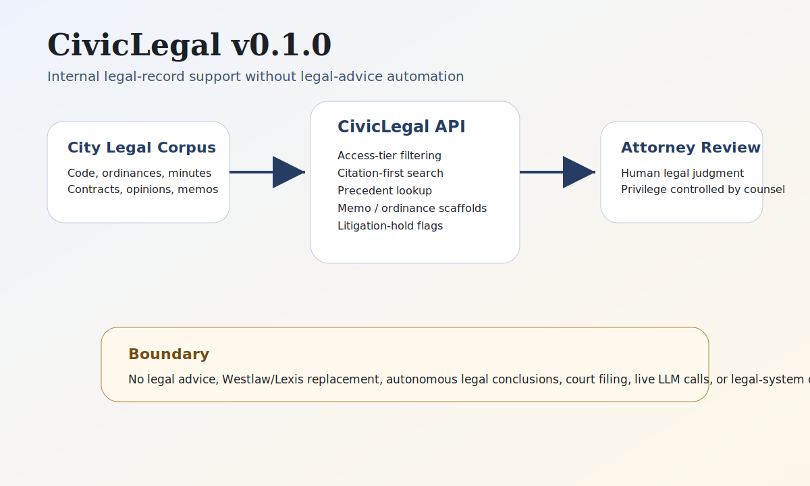

# CivicLegal User Manual

## What CivicLegal Is

CivicLegal helps authorized municipal legal staff work with the city's own legal record. It supports cited internal search, prior-action lookup, attorney-reviewed memo scaffolds, ordinance comparison checklists, litigation-hold candidate flags, optional saved memo/hold workpapers, and authority citation tracking.

CivicLegal does not provide legal advice. It does not replace Westlaw, Lexis, outside counsel, court filing systems, e-discovery systems, or attorney judgment.

## Non-Technical Staff Guide

### Typical Workflow

1. Confirm your role and access tier before searching.
2. Search city records for a question, topic, ordinance, resolution, contract, or prior council action.
3. Review returned citations and excerpts.
4. Draft a memo outline or ordinance comparison checklist only for attorney review.
5. Flag possible litigation-hold candidates for attorney and records review.
6. Do not treat CivicLegal output as legal advice or a final legal conclusion.

### Access-Tier Rules

- Public records may be visible to all roles.
- Staff records are for authorized staff.
- Attorney-tier records are for legal staff.
- Privileged/work-product records are isolated and must be controlled by the city attorney.

## IT / Technical Guide

```bash
python -m pip install -e ".[dev]"
python -m uvicorn civiclegal.main:app --host 127.0.0.1 --port 8140
```

CivicLegal v0.1.2 depends on the published `civiccore` v0.11.0 release wheel.

Set `CIVICLEGAL_WORKPAPER_DB_URL` to enable SQLAlchemy-backed attorney-review memo draft and litigation-hold preflight records. Leave it unset for deterministic stateless operation.

Run the release gate:

```bash
bash scripts/verify-release.sh
```

The release gate checks documentation, placeholder imports, tests, Ruff, package build output, SHA256 sums, and package version.

## Supporting Architecture



CivicLegal v0.1.2 is conservative by design. The city attorney controls corpus access and privileged records. CivicLegal filters records by access tier through shared CivicCore search-access helpers, returns citations, and prepares review artifacts. Attorneys approve all legal work. Future releases can add live CivicCode, CivicClerk, and CivicContracts imports without weakening the human-review and privilege boundaries.
